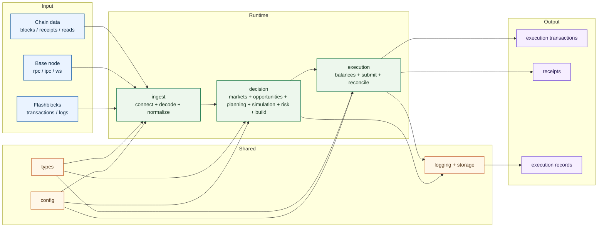

# Base Execution Engine

Base Execution Engine is a Rust workspace for low-latency onchain execution on
Base. It is designed around the full production loop: ingest market and chain
signals, build a runtime view of pools, opportunities, balances, and pending
executions, simulate and risk-check candidate routes, submit transactions, and
reconcile realized outcomes.

## Scope

The system is built for execution workloads that depend on both
pre-confirmation signals and canonical chain state. The intended runtime shape
is:

- ingest pre-confirmation transactions and logs
- normalize external payloads into internal events
- maintain an engine-owned runtime view of market state, account state, and
  execution progress
- detect and rank actionable opportunities
- plan routes and simulate expected outcomes
- apply risk checks before any submission
- build execution requests and broadcast transactions
- track receipts and classify final outcomes

## Architecture



## Runtime Flow

```text
input event
-> ingest
-> market/account/execution update
-> opportunity detection
-> route planning
-> simulation
-> risk decision
-> execution build
-> transaction submission
-> receipt reconciliation
-> recorded outcome
```

## Workspace Layout

```text
crates/
  app/        runtime entrypoint and wiring
  config/     typed configuration and validation
  types/      shared domain types and errors
  ingest/     connectors, decoding, normalization, protocol metadata
  decision/   markets, opportunities, planner, simulator, risk, builder
  execution/  balances, nonce handling, submission, reconciliation, outcomes
contracts/
  BaseExecutionRouter.sol
```

## Crate Responsibilities

### `app`

- starts the runtime
- loads configuration
- initializes logging
- wires dependencies across crates
- owns process lifecycle

### `config`

- environment loading
- typed config structs
- validation for limits, modes, and safety settings

### `types`

- shared identifiers and enums
- observed events and normalized intents
- opportunity and planning types
- simulation and risk result types
- execution request, attempt, and receipt types

### `ingest`

- external connectivity
- calldata and log decoding
- event normalization
- protocol and venue metadata needed during ingest

### `decision`

- market, account, and execution state needed for decision-making
- opportunity detection
- route planning
- simulation
- risk checks
- execution request building

### `execution`

- balances and allowances
- nonce handling
- transaction submission
- receipt tracking
- terminal outcome classification
